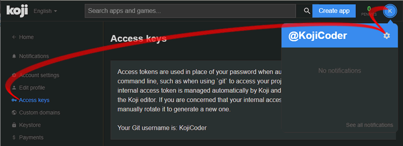
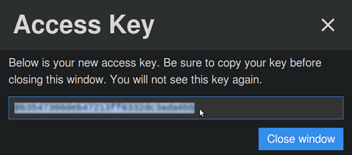

# Using Git to Manage Your Project

Koji provides a feature-rich online project editor, but as a developer you are probably used to working with your own suite of development tools. In this tutorial, I will describe how to use Git to clone a Koji project template to your development machine, so that you can work on it locally to build your own game.

This is the first section in a three-part tutorial. You can find the other two sections here:

2. [Working Locally](working_locally.md)
3. [Publishing the Project You Developed Locally](publishing_your_local_project.md)

## Required Tools

In order to develop your Koji project locally, you will need four tools:

1.  The open source **Git** version control system. Koji stores each template and each remixed project as a separate Git repository. To work on a project locally, you will need to use Git to download a clone of your project to your local hard-drive. You can then make changes and use Git to push the changes back to the `origin` repository on the Koji servers.  

    This tutorial assumes that you already have [Git](https://git-scm.com/downloads) installed on your computer, and that you are familiar with the basic Git commands. If you need to install Git on your computer, please do that first. You can find all the necessary information [here](https://git-scm.com/book/en/v2/Getting-Started-Installing-Git).
2.  The open source **Node.js** server environment. Koji uses Node.js and many add-on packages to deliver your web app to your users' browsers. You will need to [install Node.js](https://nodejs.org/en/download/) and its associated Node Package Manager (NPM) in order to run a Node server on your development computer.

3.  A Terminal application. You will be typing commands that use `git` and `npm` to set up your development environment. Depending on your operating system, the application you use will be different. Here are some suggestions:

    *   [Terminal](https://blog.teamtreehouse.com/introduction-to-the-mac-os-x-command-line) on macOS
    *   [GitBash](https://msysgit.github.io) on Windows
    *   [Linux Terminal](https://www.howtogeek.com/140679/beginner-geek-how-to-start-using-the-linux-terminal/) on Linux
4.  A text editor. This is where you will edit your code, and save it as plain-text files. A text editor that is designed for writing code will help you in many ways. Computers do exactly what you tell them to do, even if you tell them the wrong things. A dedicated text editor will make it easier for you to find the right words to use, and to find where you have used the wrong words or the wrong structure. You can find a list of recommended text editors [here](https://kinsta.com/blog/best-text-editors/), including several which are both excellent and free.

## Choosing a template for your project

You can find many game templates on the [Scaffolds (For Developers)](https://withkoji.com/tag/scaffolds-(for-developers)?sort=remixes) page. The instructions you find below should work well with any of them. For this tutorial, I am going to use Svarog's [Element Match](https://withkoji.com/~Svarog1389/element-match) template, because it features in the [How To](https://www.youtube.com/watch?v=R7FAL2IV0sk&feature=youtu.be) video tutorial, and it illustrates a completed game with code that runs both on the backend and on the frontend. If you choose to work on a different project, the screenshots in this tutorial will not match what you see on your own screen.

To get started, visit the [Element Match](https://withkoji.com/~Svarog1389/element-match) project and click on the `∞ Remix` button. After a short loading time, Koji's Online Editor will open.

## Editor Overview

The Online Editor is divided into 4 sections:

1.  A column of Links on the left
2.  An editing pane which allows multiple open tabs in the center
3.  A Preview pane on the right
4.  A collapsible Terminal pane, with multiple tabs, at the bottom


**Note:** For more details about remixing a project in the Online Editor, please read the [Remixing Apps](../01_general/remixing.md) tutorial.


## Cloning the Git Repository

When you click on `∞ Remix` (for any project), Koji creates a new fork of the project's Git repository just for you. Your new repository will have a unique identifier string. If you fork the same project twice, you will get a different identifier string each time. The Koji repositories are stored at https://projects.koji-cdn.com/.

In order to clone your Koji repository locally, you will need three strings:

*   The URL of the repository on https://projects.koji-cdn.com/
*   The Username that you created when you registered with Koji
*   An Access Token, which you will need to generate and store securely (see below).

You will need to use the repository URL only once, you should know your Username by heart, but the Access Token is a 32-character randomly-generated hexadecimal number, and you will need to make a note of it in a safe place.

### Repository URL

To find the URL of the Koji repository, open your project page and in the bottom left corner of the page, click on the disclose triangle beside the Settings icon to see a link to your Repository settings. Click on that to open the Repository Settings pane.


The Repository Settings pane will show links to two repositories. The first is called Remote Repository, and this is the personal repository for your game.

**Note:** The second repository in the list – the Upstream Repository – is the one that your project was forked from. If your intention is to propose improvements to the scaffold itself, then you can modify your Remote Repository and subsequently create Pull Requests, so that the Koji team can evaluate your proposed changes and update the scaffold if they like what you've done.

Copy the Remote Repository URL, open a Terminal window, navigate to the directory on your local drive where you want to save your project and:

*  Type `git clone` followed by a space
*  Paste the repository URL that you just copied
*  Type a space
*  Type the name of the director that you want Git to create to hold your project
*  Press the Enter key.

Your Terminal window might now look something like this:

```bash
~/Repos/Koji$ git clone https://projects.koji-cdn.com/a70f8329-e89e-48b0-8d85-7658c1542b9f.git MyKojiGame
Cloning into 'MyKojiGame'...
Username for 'https://projects.koji-cdn.com':
```

The Terminal is asking for your Username, and after that it will ask for a Password. This password is **not** the same as the password you use to log in to Koji. It is a strong machine-generated access key, which only you should ever know about.

### Access Key

To generate an Access Key, you need to visit the [Access key](https://withkoji.com/settings/access-keys) pane in your Settings page. There are two ways to find your Settings page:

1.  From your [Home page](https://withkoji.com/), press the Settings button at the bottom left
2.  From any page, press your avatar in the top right corner, and then on the Cog icon, as shown in the screenshot below.

When you are on your Settings page, press the [Access keys](https://withkoji.com/settings/access-keys) link in the column on the left.



On the Access Key page, click on the Generate New Token link at the top right.


An overlay window will open containing a 128-bit number in hexadecimal form. Copy this number and keep it somewhere safe, where only you can find it easily. You will need to use it each time you clone, pull or push to the `origin` repository.



After you close the overlay window, this number will be known only as `Token 1`, and you will have no way to retrieve it from the Koji site again. You can, however, revoke your token and generate a new one if you have forgotten it, or if you believe that someone unauthorized has discovered it.

### Username

Your username for the Koji Git repository is the same as the name you chose when you registered with Koji. For reference, it is shown at the bottom of the paragraph above your list of tokens.

### Authorizing Git to Clone the Repository

In the Terminal window, type in your Username, then press the Enter key. When asked for the password, paste in the 32-character hex string that you copied from the Access Key overlay window. (Remember than in some Terminal windows, `Ctrl-C` means "Cancel", so you may have to use `Shift-Ctrl-C` to paste). The password that you pasted will not be shown. Press the Enter key to start the cloning process.

```bash
~/Repos/Koji$ git clone https://projects.koji-cdn.com/a70f8329-e89e-48b0-8d85-7658c1542b9f.git MyKojiGame
Cloning into 'MyKojiGame'...
Username for 'https://projects.koji-cdn.com': KojiCoder # Use your own username
Password for 'https://KojiCoder@projects.koji-cdn.com': # Paste in your Access Key
remote: Counting objects: 15941, done.
remote: Compressing objects: 100% (6156/6156), done.
remote: Total 15941 (delta 9517), reused 15941 (delta 9517)
Receiving objects: 100% (15941/15941), 9.35 MiB | 754.00 KiB/s, done.
Resolving deltas: 100% (9517/9517), done.
Checking connectivity... done.
```

## What You Get

You should now have a new directory full of files that have been downloaded from the `origin` repository. Now you can `cd` into your `MyKojiGame` directory, and look at what has been cloned in:

```bash
~/Repos/Koji$ cd MyKojiGame/
~/Repos/Koji$ ls -al
total 40
drwxrwxr-x  6 kojicoder dev 4096 nov  5 16:38 .
drwxrwxr-x 11 kojicoder dev 4096 nov  5 17:00 ..
drwxrwxr-x  3 kojicoder dev 4096 nov  5 16:38 backend
-rw-rw-r--  1 kojicoder dev  516 nov  5 16:38 Dockerfile
drwxrwxr-x  5 kojicoder dev 4096 nov  5 16:38 frontend
drwxrwxr-x  8 kojicoder dev 4096 nov  5 16:38 .git
-rw-rw-r--  1 kojicoder dev  186 nov  5 16:38 .gitignore
drwxrwxr-x  6 kojicoder dev 4096 nov  5 16:38 .koji
-rw-rw-r--  1 kojicoder dev   27 nov  5 16:38 package-lock.json
-rw-rw-r--  1 kojicoder dev  797 nov  5 16:38 README.md
```
## The Story So Far

In this section of the tutorial, you have seen how to:

*   Find the required tools: Git, Node.js, a Terminal application and a text editor
*   Find the URL of Koji's `origin` repository for your project
*   Find the username and password that allows you to interact with Koji's `origin` repository
*   Clone the Git repository for your project onto your local machine

However, before you can launch your project locally, you will need to install a set of Node module dependencies. That is the topic of the next section in this tutorial: [Working Locally](working_locally.md).
